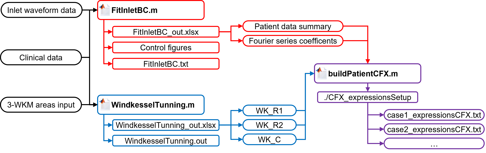
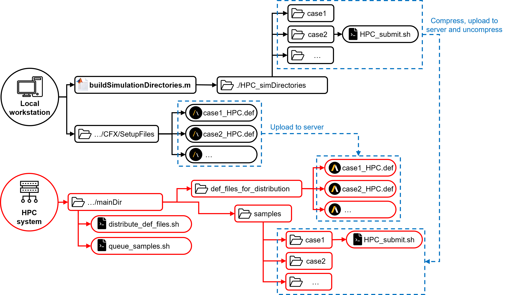

<!-- Improved compatibility of back to top link: See: https://github.com/othneildrew/Best-README-Template/pull/73 -->

<!--
*** Thanks for checking out the Best-README-Template. If you have a suggestion
*** that would make this better, please fork the repo and create a pull request
*** or simply open an issue with the tag "enhancement".
*** Don't forget to give the project a star!
*** Thanks again! Now go create something AMAZING! :D
-->

<!-- PROJECT SHIELDS -->
<!--
*** I'm using markdown "reference style" links for readability.
*** Reference links are enclosed in brackets [ ] instead of parentheses ( ).
*** See the bottom of this document for the declaration of the reference variables
*** for contributors-url, forks-url, etc. This is an optional, concise syntax you may use.
*** https://www.markdownguide.org/basic-syntax/#reference-style-links
-->
<!-- [![Contributors][contributors-shield]][contributors-url]
[![Forks][forks-shield]][forks-url]
[![Stargazers][stars-shield]][stars-url]
[![Issues][issues-shield]][issues-url]
[![MIT License][license-shield]][license-url]
[![LinkedIn][linkedin-shield]][linkedin-url] -->

<!-- PROJECT LOGO -->
 

  <!--  -->

<h3 align="center">PASCAL-CFD</h3>

  

    PAtient-SpecifiC Aortic bLood flow Compuational Fluid Dynamics toolbox
     
    <a href="https://github.com/ImperialCollegeLondon/PASCAL-CFD"><strong>Explore the docs »</strong></a>
     
     
    <a href="https://github.com/ImperialCollegeLondon/PASCAL-CFD/issues">Report Bug</a>
    ·
    <a href="https://github.com/ImperialCollegeLondon/PASCAL-CFD/issues">Request Feature</a>
  

<!-- TABLE OF CONTENTS -->

  
Table of Contents

  <ol>
    <li>
      <a href="#about-the-project">About The Project</a>
    </li>
    <li>
      <a href="#getting-started">Getting Started</a>
    </li>
    <li><a href="#usage">Usage</a></li>
    <li><a href="#license">License</a></li>
    <li><a href="#contact">Contact</a></li>
<!--     <li><a href="#acknowledgments">Acknowledgments</a></li>  -->
  </ol>

<!-- ABOUT THE PROJECT -->
## About The Project

PASCAL CFD is a toolbox comprising a set of scripts that implement a semi-automated methodology for performing patient-specific blood flow CFD simulations within portions of the aorta. The project has been developed at the Xu Group (Biofluids and Transport) at Imperial College London.

The provided scripts are mainly geared towards CFD simulation with ANSYS CFX and postprocessing with ANSYS EnSight. However, parts of the code provided could be useful for projects using other software.

Detailed explanation of the workflow and the implemented methodology are to be provided by a future paper, which will be linked if and when published.

(<a href="#readme-top">back to top</a>)

<!-- GETTING STARTED -->
## Getting Started

The project comprises a set of stand-alone scripts to be executed sequentially for the different phases of a CFD project concerning portions of the aorta (i.e. preprocessing and simulation setup, running simulation and post-processing).
- For preprocessing purposes, you should be able to run MATLAB scripts.
- For using the shell utility scripts, intended for helping with running simulations, you should have access to a linux-style console (Bash).
- For using the postprocessing scripts, Python is required. However, these scripts are intended to be used from within ANSYS EnSight, which should not require an extra Python installation.

(<a href="#readme-top">back to top</a>)

<!-- USAGE EXAMPLES -->
## Usage

The toolbox's intended workflow is described below.

  
Preprocessing and simulation setup

  
A series of scripts are provided for tuning patient-specific boundary conditions for both the inlet and the outlet.
1. **Tune inlet boundary conditions for each patient with `fitInletBC.m`**
    
    Configure the following parameters:
    - `nTerms`: number of modes (harmonics) to be considered for the Fourier series approximation of the reference inlet waveform.
    - `divFrac`: fraction of the patient's Stroke Volume (SV) that is diverted to other branches before reaching the inlet of the simulation domain. E.g. according to Moore & Ku (1994), divFrac=0.25 for the descending aorta (25% of the flow is diverted to the arch's branches).

    Import the required data as indicated within the script's commentaries. The following tables should be set up by the user:
    - `refInletWave`: should contain the time (in seconds) and flow (in cubic metres per second) coordinates for the points describing the reference waveform, with variable (column) names 'Time' and 'Qin'.
    
      *Notice that it is assumed that a full period is described (i.e. the pulse described starts at time zero and the last time stamp corresponds to the period of the reference wave).*
    

        <table style="margin: 0 auto;">
            <tr>
                <th style="text-align: center;">Time [s]</th>
                <th style="text-align: center;">Qin [m3/s]</th>
            </tr>
            <tr>
                <td style="text-align: center;">0</td>
                <td style="text-align: center;">Qin_0</td>
            </tr>
            <tr>
                <td style="text-align: center;">Time_1</td>
                <td style="text-align: center;">Qin_1</td>
            </tr>
            <tr>
                <td style="text-align: center;">. . .</td>
                <td style="text-align: center;">. . .</td>
            </tr>
            <tr>
                <td style="text-align: center;">T_end</td>
                <td style="text-align: center;">Qin_end</td>
            </tr>
        </table>
    

    - `clinicalData`: should contain the following variables, with each row corresponding to one patient.
      -  `Case`: case name for each patient (string within a cell, `clincalData.Case` should produce a cell array).
      -  `SP`: average systolic cuff pressure reading, in mmHg.
      -  `DP`: average diastolic cuff pressure reading, in mmHg.
      -  `HR`: heart rate, in bpm.
      -  `phi`: haematocrit fraction.
    

        <table style="margin: 0 auto;">
            <tr>
                <th style="text-align: center;">Case</th>
                <th style="text-align: center;">SP [mmHg]</th>
                <th style="text-align: center;">DP [mmHg]</th>
                <th style="text-align: center;">HR [bpm]</th>
                <th style="text-align: center;">phi</th>
            </tr>
            <tr>
                <td style="text-align: center;">case1</td>
                <td style="text-align: center;">140.0</td>
                <td style="text-align: center;">78.0</td>
                <td style="text-align: center;">75.0</td>
                <td style="text-align: center;">0.388</td>
            </tr>
            <tr>
                <td style="text-align: center;">. . .</td>
                <td style="text-align: center;">. . .</td>
                <td style="text-align: center;">. . .</td>
                <td style="text-align: center;">. . .</td>
                <td style="text-align: center;">. . .</td>
            </tr>
        </table>
    

    The output from the execution should be the following:
    
    - `FitInletBC_out.xlsx`: Excel book containing the following two pages.
      - `patientResults`: table containing some patient-specific variables required for the CFD simulation setup:
        - `Case`: case name for each patient.
        - `T`: heart beat period, in s.
        - `Pmean`: average pressure, in mmHg.
        - `Vp`: blood volume going through the inlet of the CFD domain within one heart beat, in m3.
        - `ScaleFactor`: amplitude scale factor for the reference waveform.
        - `phi`: haematocrit fraction.
        

        <table style="margin: 0 auto;">
            <tr>
                <th style="text-align: center;">Case</th>
                <th style="text-align: center;">T [s]</th>
                <th style="text-align: center;">Pmean [mmHg]</th>
                <th style="text-align: center;">Vp [m3]</th>
                <th style="text-align: center;">ScaleFactor</th>
                <th style="text-align: center;">phi</th>
            </tr>
            <tr>
                <td style="text-align: center;">case1</td>
                <td style="text-align: center;">0.80</td>
                <td style="text-align: center;">102.8</td>
                <td style="text-align: center;">6.02E-05</td>
                <td style="text-align: center;">2.319</td>
                <td style="text-align: center;">0.388</td>
            </tr>
            <tr>
                <td style="text-align: center;">. . .</td>
                <td style="text-align: center;">. . .</td>
                <td style="text-align: center;">. . .</td>
                <td style="text-align: center;">. . .</td>
                <td style="text-align: center;">. . .</td>
                <td style="text-align: center;">. . .</td>
            </tr>
        </table>
        

      - `baseFourierSeries`: table containing the Fourier series coefficients for the approximated reference waveform, up to the nTerms-th mode.
    - `FitInletBC.txt`: plain text file reporting on the Fourier series approximation obtained (analytical expression and adjusted coefficients).
    - Control figures: two figures are produced:
      - `Fig_seriesVsOriginalData`: figure comparing the original reference waveform, as described by the imported coordinates, and the approximated result by a truncated Fourier series decomposition. Allows to qualitatively evaluate if enough modes have been considered.
      - `Fig_patientSpecificInflow`: figure depicting all the scaled inlet waveforms, for all the patients within the cohort.
2. **Tune three-element windkessel models (3-EWM) for each outlet boundary condition for each patient with `windkesselTuning.m`**
   
    Configure the following parameters:
   - `missingArteryManagement`: numeric (integer) switch, defines what to do with the flow of implicitly represented branches for adjusting reference flow split factors.
   - `flowSplitFactorReference`: numeric (integer) switch, defines which literature reference to use for flow split factors.
   - `branchesWithinDomain`: cell array containing strings which identify which branching arteries lie within the portion of the aorta that is being simulated.
  
    *Notice that this is an anatomical description, but some of these branches may not be part of the CFD domain (implicitly represented branches).*

    Import the required data as indicated within the script's commentaries. The following tables tables should be set up by the user:
    - `area`: contains the area of the inlet and each branching outlet considered. The first column should be `Case`, containing the case name for each patient (string within a cell, `area.Case` should produce a cell array). The other columns should be the area, in m2, for the outlet branches. The names of these variables should be compatible with the code name assigned to each branch within the program (in particular, within the `outletBranchesProgrammed` cell array).
  
    *Notice that if an outlet branch is to be implicitly represented within the CFD simulation domain, its corresponding colum should be missing or its area should be set to zero within the table. For example, in the table below, corresponding to a domain extending from the thoracic aorta to the iliac bifurcation, the Right Renal Artery (RRA) and Left Renal Artery (LRA) are implicitly represented for all patients (columns missing), and the Superior Mesenteric Artery (SMA) is implicitly represented for case2 (area is set to zero), but not for case1 (non-zero area).*
    

    <table style="margin: 0 auto;">
        <tr>
            <th style="text-align: center;">Case</th>
            <th style="text-align: center;">Inlet [m2]</th>
            <th style="text-align: center;">CA [m2]</th>
            <th style="text-align: center;">SMA [m2]</th>
            <th style="text-align: center;">RIA [m2]</th>
            <th style="text-align: center;">LIA [m2]</th>
        </tr>
        <tr>
            <td style="text-align: center;">case1</td>
            <td style="text-align: center;">4.75E-04</td>
            <td style="text-align: center;">3.12E-05</td>
            <td style="text-align: center;">6.02E-05</td>
            <td style="text-align: center;">1.59E-04</td>
            <td style="text-align: center;">7.31E-05</td>
        </tr>
        <tr>
            <td style="text-align: center;">case2</td>
            <td style="text-align: center;">5.61E-04</td>
            <td style="text-align: center;">6.25E-05</td>
            <td style="text-align: center;">0</td>
            <td style="text-align: center;">7.75E-05</td>
            <td style="text-align: center;">1.43E-04</td>
        </tr>
        <tr>
            <td style="text-align: center;">. . .</td>
            <td style="text-align: center;">. . .</td>
            <td style="text-align: center;">. . .</td>
            <td style="text-align: center;">. . .</td>
            <td style="text-align: center;">. . .</td>
            <td style="text-align: center;">. . .</td>
        </tr>
    </table>
    

    - `clinicalData`: should contain the following variables, with each row corresponding to one patient.
      -  `Case`: case name for each patient (string within a cell, `clincalData.Case` should produce a cell array).
      -  `SP`: average systolic cuff pressure reading, in mmHg.
      -  `DP`: average diastolic cuff pressure reading, in mmHg.
      -  `Qin`: time-averaged (over a cardiac cycle) inflow to the domain, in mL/s.
 
        *Notice that if Qin is not computed externally and loaded with the rest of the data, it can be approximated by uncommenting the lines provided within the code. Also notice that SP, DP and Qin are to be converted into SI base units after being loaded (already implemented at the end of the loading section).*
    
    The output from the execution should be the following:
    
    - `WindkesselTuning_out.xlsx`: Excel book containing the following three pages.
      - `WK_Rc`: table containing the proximal resistance (R1 or Rc) results for each patient and each branch. The first column `Case`, identifies the patient (on patient per rwo). The other columns correspond to the resistance value, and are named according to the implemented convention (in particular, within the `outletBranchesProgrammed` cell array).
      - `WK_Rc`: table containing the distal resistance (R2 or Rp) results for each patient and each branch. Structure is analogous to `WK_Rc`.
      - `WK_C`: table containing the compliance (C) results for each patient and each branch. Structure is analogous to `WK_Rc`.
 
        *Notice that meaningless results will result for implicitly represented branches that are declared within the* `area` *table*.
    
    - `WindkesselTuning.out`: plain text file reporting the cases where the correction based on Reymond et al (2009) was needed, due to the resulting R1 values being too large (yielding negative R2 values).
  
3. **Build the expressions required for setting up each patient within ANSYS CFX-Pre with `buildPatientCFX`**
    
    This script should be adjusted to obtain the desired setup for the simulation cases at hand.

    

        
    

Running simulations

The following procedure is suggested if working within an HPC system using ANSYS CFX.

- Define a main directory for the simulation project within the HPC system.
- Upload the simulation directories (containing only the submission scripts) to a `samples` directory within the main project.
- Upload all the CFX definition files to a `def_files_for_distribution` directory within the HPC system.
- Distribute the definition files to the corresponding simulation directories. This can be automated by means of a shell script, such as the `distribute_def_files.sh` Bash script included with the toolbox.
- Queue a suitable batch of simulations. This can be automated by means of a shell script, such as the `queue_samples.sh` Bash script included with the toolbox.

    

Running simulations is evidently specific to both the simulation software being used (for now, assumed to be ANSYS CFX) and to the hardware being used (e.g. Imperial College London HPC system, using the PBS job scheduler). The scripts provided will probably need to be tailored to your particular needs, but are useful as a template. These include:
- `buildSimulationDirectories.m`: creates case directories, to be uploaded to the HPC system within the `samples` directory, and includes a PBS submission script for the simulation job.
- `delete_distributed_def_files.sh`: deletes all the `*.def` files indicated.
- `distribute_def_files.sh`: distributes all the `*.def` files from within the `def_files_for_distribution` folder to the corresponding folders within the `samples` folder.
- `regroup_def_files.sh`: reverts `distribute_def_file.sh`.

Postprocessing

  
  Some postprocessing utility files are provided in this toolbox, comprising both simple Bash scripts and snippets of Python-coded commands to be used withing Ansys Ensight. These include calculation (`compute_TAWSS_OSI_RRT.py`) and export (`export_shear_metrics_over_part.py` and `combineExportedMetrics.sh`) of common shear metrics (i.e. TAWSS, OSI and RRT), as well as simple convergence checking (`checkConvergence.sh`).
  

(<a href="#readme-top">back to top</a>)

<!-- CONTRIBUTING -->
<!-- ## Contributing

Contributions are what make the open source community such an amazing place to learn, inspire, and create. Any contributions you make are **greatly appreciated**.

If you have a suggestion that would make this better, please fork the repo and create a pull request. You can also simply open an issue with the tag "enhancement".
Don't forget to give the project a star! Thanks again!

1. Fork the Project
2. Create your Feature Branch (`git checkout -b feature/AmazingFeature`)
3. Commit your Changes (`git commit -m 'Add some AmazingFeature'`)
4. Push to the Branch (`git push origin feature/AmazingFeature`)
5. Open a Pull Request

(<a href="#readme-top">back to top</a>)

 -->

<!-- LICENSE -->
## License

Information regarding this toolbox's licence can be found in the `LICENSE` file. 

<!-- Distributed under the MIT License. See `LICENSE.txt` for more information. -->

(<a href="#readme-top">back to top</a>)

<!-- CONTACT -->
## Contact

Andrés Vignolo Cortabarría - andres.vignolo23@imperial.ac.uk

Project Link: [https://github.com/ImperialCollegeLondon/PASCAL-CFD](https://github.com/ImperialCollegeLondon/PASCAL-CFD)

(<a href="#readme-top">back to top</a>)

<!-- ACKNOWLEDGMENTS 
## Acknowledgments
All acknowledgments are to be added!
* 
* 
* 

(<a href="#readme-top">back to top</a>)

-->

<!-- MARKDOWN LINKS & IMAGES -->
<!-- https://www.markdownguide.org/basic-syntax/#reference-style-links -->
[contributors-shield]: https://img.shields.io/github/contributors/avignolo/PASCAL-CFD.svg?style=for-the-badge
[contributors-url]: https://github.com/ImperialCollegeLondon/PASCAL-CFD/graphs/contributors
[forks-shield]: https://img.shields.io/github/forks/avignolo/PASCAL-CFD.svg?style=for-the-badge
[forks-url]: https://github.com/ImperialCollegeLondon/PASCAL-CFD/network/members
[stars-shield]: https://img.shields.io/github/stars/avignolo/PASCAL-CFD.svg?style=for-the-badge
[stars-url]: https://github.com/ImperialCollegeLondon/PASCAL-CFD/stargazers
[issues-shield]: https://img.shields.io/github/issues/avignolo/PASCAL-CFD.svg?style=for-the-badge
[issues-url]: https://github.com/ImperialCollegeLondon/PASCAL-CFD/issues
[license-shield]: https://img.shields.io/github/license/avignolo/PASCAL-CFD.svg?style=for-the-badge
[license-url]: https://github.com/ImperialCollegeLondon/PASCAL-CFD/blob/master/LICENSE.txt
[linkedin-shield]: https://img.shields.io/badge/-LinkedIn-black.svg?style=for-the-badge&logo=linkedin&colorB=555
[linkedin-url]: https://linkedin.com/in/linkedin_username
[product-screenshot]: images/screenshot.png
[Next.js]: https://img.shields.io/badge/next.js-000000?style=for-the-badge&logo=nextdotjs&logoColor=white
[Next-url]: https://nextjs.org/
[React.js]: https://img.shields.io/badge/React-20232A?style=for-the-badge&logo=react&logoColor=61DAFB
[React-url]: https://reactjs.org/
[Vue.js]: https://img.shields.io/badge/Vue.js-35495E?style=for-the-badge&logo=vuedotjs&logoColor=4FC08D
[Vue-url]: https://vuejs.org/
[Angular.io]: https://img.shields.io/badge/Angular-DD0031?style=for-the-badge&logo=angular&logoColor=white
[Angular-url]: https://angular.io/
[Svelte.dev]: https://img.shields.io/badge/Svelte-4A4A55?style=for-the-badge&logo=svelte&logoColor=FF3E00
[Svelte-url]: https://svelte.dev/
[Laravel.com]: https://img.shields.io/badge/Laravel-FF2D20?style=for-the-badge&logo=laravel&logoColor=white
[Laravel-url]: https://laravel.com
[Bootstrap.com]: https://img.shields.io/badge/Bootstrap-563D7C?style=for-the-badge&logo=bootstrap&logoColor=white
[Bootstrap-url]: https://getbootstrap.com
[JQuery.com]: https://img.shields.io/badge/jQuery-0769AD?style=for-the-badge&logo=jquery&logoColor=white
[JQuery-url]: https://jquery.com 
